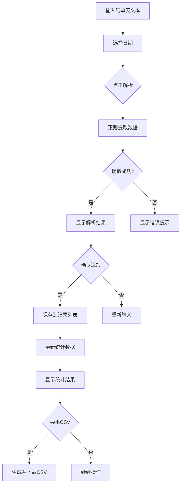

## 1. Product Overview
『鸢青』结单表处理系统是一个专为游戏代练团队设计的账单管理工具，支持自动提取结单表信息、按日期范围筛选统计月营业额和流水排行，帮助团队高效管理财务数据。

## 2. Core Features

### 2.1 User Roles
| Role | Registration Method | Core Permissions |
|------|---------------------|------------------|
| 团队管理员 | 无需注册 | 输入结单表、筛选日期、查看统计、导出数据 |

### 2.2 Feature Module
1. **结单表输入**: 支持粘贴或手动输入结单表文本
2. **数据提取**: 自动解析提取类型、派单、代陪、金额等信息
3. **日期选择**: 支持指定开始日期和结束日期
4. **记录管理**: 查看历史记录、删除记录、按日期筛选
5. **统计分析**: 按日期范围计算营业额、流水排行榜
6. **数据导出**: 支持CSV格式导出筛选后的记录

### 2.3 Page Details
| Page Name | Module Name | Feature description |
|-----------|-------------|---------------------|
| 首页 | 输入区域 | 多行文本框，支持粘贴结单表格式文本 |
| 首页 | 日期选择 | 开始日期和结束日期选择器 |
| 首页 | 解析结果 | 展示提取的各项数据，可编辑修正 |
| 首页 | 记录表格 | 展示筛选后的历史记录，支持删除操作 |
| 首页 | 统计面板 | 日期范围内营业额汇总、派单/代陪流水排行 |
| 首页 | 导出功能 | 一键导出CSV文件 |

## 3. Core Process

用户粘贴结单表文本 → 选择日期 → 点击解析按钮 → 系统自动提取数据 → 显示解析结果 → 确认添加到记录 → 按日期筛选查看统计 → 导出数据

## 4. User Interface Design

### 4.1 Design Style
- **主色调**: 紫色渐变 (#8B5CF6 → #EC4899)，营造梦幻氛围
- **辅助色**: 金色 (#FBBF24) 用于强调和按钮
- **按钮风格**: 圆角矩形，渐变背景，悬停发光效果
- **字体**: 思源黑体，标题加粗
- **布局**: 卡片式布局，左右分栏
- **图标**: 使用Emoji增添活力 (🦋, ✨, 📊)

### 4.2 Page Design Overview
| Page Name | Module Name | UI Elements |
|-----------|-------------|-------------|
| 首页 | 头部 | 渐变标题背景，蝴蝶装饰 |
| 首页 | 输入区域 | 深色边框文本框，日期选择器，解析按钮 |
| 首页 | 结果卡片 | 玻璃拟态效果，数据标签 |
| 首页 | 记录表格 | 斑马纹表格，操作按钮 |
| 首页 | 统计面板 | 卡片展示，排行榜列表 |
| 首页 | 导出按钮 | 醒目的金色按钮 |

### 4.3 Responsiveness
- 桌面端: 左右分栏布局
- 移动端: 垂直堆叠布局
- 触摸优化: 按钮尺寸加大，间距增加
