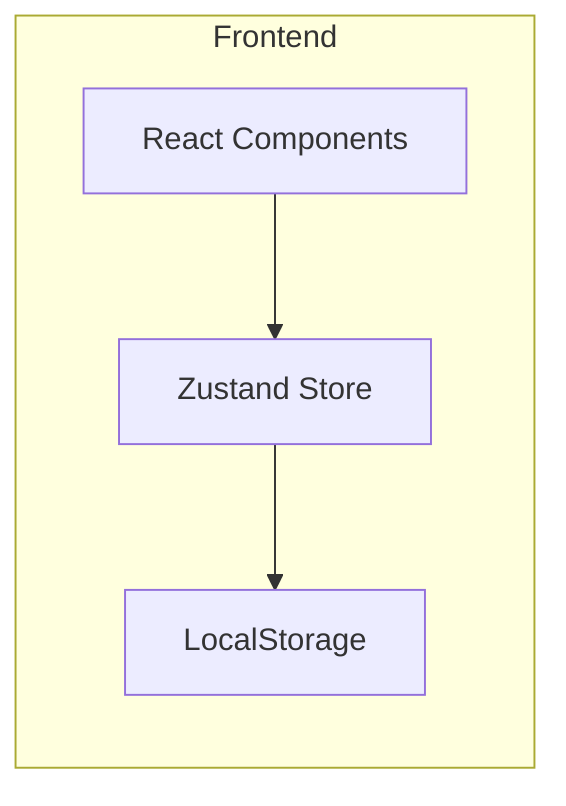
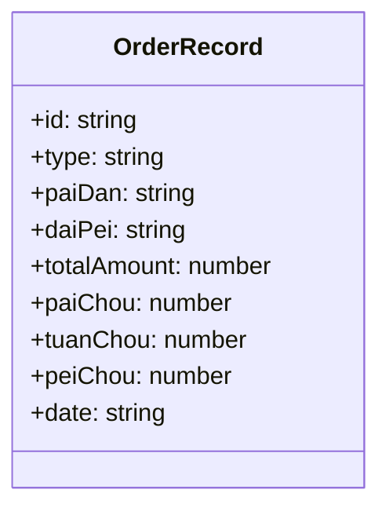

## 1. Architecture Design



## 2. Technology Description
- Frontend: React@18 + TypeScript + tailwindcss@3
- Initialization Tool: vite-init
- State Management: Zustand
- Data Storage: LocalStorage
- Icons: Lucide React

## 3. Route Definitions
| Route | Purpose |
|-------|---------|
| / | 首页，包含所有功能模块 |

## 4. Data Model

### 4.1 Data Model Definition



### 4.2 TypeScript Interface
```typescript
interface OrderRecord {
  id: string;
  type: string;
  paiDan: string;
  daiPei: string;
  totalAmount: number;
  paiChou: number;
  tuanChou: number;
  peiChou: number;
  date: string;
}

interface Statistics {
  totalRevenue: number;
  paiDanRanking: { name: string; amount: number }[];
  daiPeiRanking: { name: string; amount: number }[];
}

interface DateRange {
  startDate: string;
  endDate: string;
}
```

## 5. Component Structure

```
src/
├── components/
│   ├── Header.tsx          # 页面头部
│   ├── InputArea.tsx       # 结单表输入区域
│   ├── DateSelector.tsx    # 日期选择器
│   ├── ParseResult.tsx     # 解析结果展示
│   ├── RecordTable.tsx     # 记录表格
│   ├── Statistics.tsx      # 统计面板
│   └── ExportButton.tsx    # 导出按钮
├── hooks/
│   └── useOrderStore.ts    # Zustand状态管理
├── utils/
│   └── parser.ts           # 结单表解析工具
├── App.tsx
├── main.tsx
└── index.css
```

## 6. Parsing Logic

正则表达式规则：
- `⪩类型⪨：(.*)` → 提取类型
- `⪩派单⪨：(.*)` → 提取派单员
- `⪩代陪⪨：(.*)` → 提取代陪员
- `⪩总金额⪨：([\d.]+)` → 提取总金额
- `⪩派抽⪨：([\d.]+)` → 提取派抽
- `⪩团抽⪨：([\d.]+)` → 提取团抽
- `⪩陪抽⪨：([\d.]+)` → 提取陪抽

## 7. Export Functionality

CSV导出格式：
```csv
日期,类型,派单,代陪,总金额,派抽,团抽,陪抽
2024-01-15,代肝,江瓷,染卿,10,1,0.4,8.6
```
